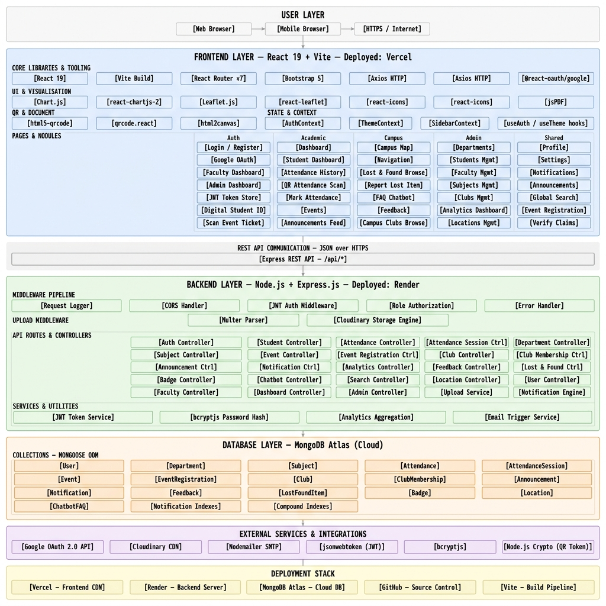

<div align="center">

# CampusConnect

<picture>
  <source media="(prefers-color-scheme: dark)" srcset="./client/public/logo-dark.png">
  <source media="(prefers-color-scheme: light)" srcset="./client/public/logo-light.png">
  
</picture>


**One Platform for Students, Faculty & Campus Life**

A production-grade, full-stack University Management Portal built using the MERN Stack — combining authentication, academic management, attendance, events, campus navigation, analytics, and an AI-style FAQ assistant into a single, unified platform.

[]()
[]()
[]()
[]()
[]()
[](https://campusconnectpdeu.vercel.app/)

</div>

CampusConnect is a full-stack university management system that unifies authentication, academics, attendance, events, clubs, campus navigation, analytics, feedback, and lost & found into a single, role-aware platform for students, faculty, and administrators — built end-to-end across 10 structured development phases.

---


# 📖 Table of Contents

- [✨ Features](#-features)
- [🎓 Roles & Permissions](#-roles--permissions)
- [🏗️ Architecture](#️-architecture)
- [🖥️ Tech Stack](#️-tech-stack)
- [🚀 Getting Started](#-getting-started)
- [📡 API Reference](#-api-reference)
- [🔧 Configuration](#-configuration)
- [🎨 Design System](#-design-system)
- [📂 Project Structure](#-project-structure)
- [🗺️ Development Roadmap](#️-development-roadmap)
- [🤝 Contributing](#-contributing)
- [📝 License](#-license)

---

# ✨ Features

| Feature | Description |
|---|---|
| 🔐 **Full Authentication** | JWT + bcrypt, Google OAuth, OTP-based password recovery, role-based authorization (student/faculty/admin) |
| 🎨 **Light/Dark Theme** | Persistent, system-aware theme switching across the entire application |
| 🧑‍🎓 **Student/Faculty/Department Management** | Full CRUD with search, filtering, and pagination for admin |
| ✅ **Attendance System** | Manual bulk marking, QR-code self-attendance, Chart.js visual history, live percentage tracking |
| 🎉 **Events & Ticketing** | Event creation, capacity-enforced registration, QR event tickets with organizer check-in scanning |
| 🏛️ **Clubs** | Category-based club directory with join/leave membership tracking |
| 🗺️ **Campus Map & Navigation** | Interactive Leaflet map with category-coded markers, live open/closed status, straight-line navigation with distance/time estimation |
| 📢 **Announcements** | Role & department-targeted broadcast system with a searchable feed |
| 🔍 **Global Search** | Live, categorized search across Students, Faculty, Departments, Clubs, Events, and Announcements |
| 🔔 **Notifications** | Personal notification inbox with unread tracking, auto-generated on key events (absences, registrations, announcements) |
| 📊 **Analytics Dashboard** | Attendance trends, department/faculty distribution, club membership, and event participation — all via Chart.js |
| 💬 **Feedback System** | Anonymous or named feedback targeting faculty/subjects/general campus, with admin oversight |
| 🎒 **Lost & Found** | Report, browse, claim, and admin-verified item recovery |
| 🤖 **FAQ Chatbot** | Rule-based, keyword-matched assistant with an admin-manageable knowledge base |
| 🪪 **Digital Student ID** | QR-coded ID card with one-click PDF export |
| 🏅 **Achievement Badges** | Automatically awarded based on real attendance, club, and event activity |
| 📱 **Fully Responsive** | Off-canvas mobile navigation, adaptive layouts across every module |

---

# 🎓 Roles & Permissions

| Capability | Student | Faculty | Admin |
|---|:---:|:---:|:---:|
| Dashboard, Profile, Theme | ✅ | ✅ | ✅ |
| Mark / Scan Attendance | View only | ✅ Mark | ✅ Mark |
| Manage Departments/Students/Faculty/Subjects | ❌ | ❌ | ✅ |
| Create Events, Clubs, Announcements | ❌ | Events, Announcements | ✅ All |
| Register for Events / Join Clubs | ✅ | ❌ | ❌ |
| Submit Feedback | ✅ | ❌ | ❌ |
| Review Feedback | ❌ | Own-targeted | ✅ All |
| Verify Lost & Found Claims | ❌ | ❌ | ✅ |
| View Analytics | ❌ | ❌ | ✅ |

---

# 🏗️ Architecture

## 🏗️ System Architecture

<p align="center">
  
</p>

## 🔄 Complete Application Sequence Diagram

```mermaid
sequenceDiagram
    autonumber

    actor User
    participant Browser
    participant Frontend as React Frontend
    participant API as Express REST API
    participant Auth as Auth Service
    participant Modules as App Modules
    participant DB as MongoDB Atlas

    Note over User, DB: ── REGISTRATION & AUTHENTICATION ──

    User->>Browser: Open CampusConnect
    Browser->>Frontend: Load React App (Vite)
    Frontend-->>User: Display Login / Register Page

    User->>Frontend: Submit Registration Form
    activate Frontend
    Frontend->>API: POST /api/auth/register
    activate API
    API->>Auth: Validate input & hash password (bcryptjs)
    Auth->>DB: Create User document
    DB-->>Auth: User saved
    Auth-->>API: Return JWT Token + user object
    API-->>Frontend: 201 Created { token, user }
    deactivate API
    Frontend->>Frontend: Store JWT in localStorage (AuthContext)
    deactivate Frontend

    Note over User, Frontend: Alternatively — Google OAuth Flow

    User->>Frontend: Click "Continue with Google"
    Frontend->>API: POST /api/auth/google { credential }
    activate API
    API->>Auth: Verify Google ID Token (google-auth-library)
    Auth->>DB: FindOrCreate User by email
    DB-->>Auth: User document
    Auth-->>API: JWT Token + user
    API-->>Frontend: 200 OK { token, user }
    deactivate API

    Note over User, DB: ── LOGIN & ROLE-BASED ROUTING ──

    User->>Frontend: Submit Login Credentials
    Frontend->>API: POST /api/auth/login
    activate API
    API->>Auth: Find user, matchPassword()
    Auth->>DB: findOne({ email })
    DB-->>Auth: User document
    Auth->>Auth: bcrypt.compare(password, hash)
    Auth-->>API: JWT Token + { role, name, _id }
    API-->>Frontend: 200 OK { token, user }
    deactivate API
    Frontend->>Frontend: Set AuthContext state (user, token, role)

    alt role === student
        Frontend-->>User: Render Student Dashboard
    else role === faculty
        Frontend-->>User: Render Faculty Dashboard
    else role === admin
        Frontend-->>User: Render Admin Dashboard
    end

    Note over User, DB: ── STUDENT WORKFLOWS ──

    User->>Frontend: View Attendance History
    Frontend->>API: GET /api/attendance/my (Bearer JWT)
    activate API
    API->>Auth: Verify JWT Middleware
    API->>Modules: Attendance Controller
    Modules->>DB: Query Attendance by student + subject
    DB-->>Modules: Attendance records
    Modules-->>API: Aggregated stats per subject
    API-->>Frontend: 200 OK { records, percentage }
    deactivate API
    Frontend-->>User: Display attendance chart (Chart.js)

    User->>Frontend: Scan QR Code for Attendance
    Frontend->>Frontend: html5-qrcode decodes token
    Frontend->>API: POST /api/attendance/qr/scan { token }
    activate API
    API->>Auth: Verify JWT (student role)
    API->>Modules: AttendanceSession Controller
    Modules->>DB: Find session by token, check expiry
    Modules->>DB: Verify student dept + semester eligibility
    Modules->>DB: Upsert Attendance { status: present }
    DB-->>Modules: Record saved
    Modules-->>API: Success
    API-->>Frontend: 200 OK { message: Attendance marked present }
    deactivate API
    Frontend-->>User: Show success confirmation

    User->>Frontend: Register for Event
    Frontend->>API: POST /api/events/:id/register
    activate API
    API->>Modules: EventRegistration Controller
    Modules->>DB: Create EventRegistration document
    Modules->>DB: Create Notification for student
    DB-->>Modules: Saved
    Modules-->>API: Registered + ticket token (QR)
    API-->>Frontend: 200 OK { qrToken, event }
    deactivate API
    Frontend-->>User: Display event ticket with QR code

    User->>Frontend: Join a Club
    Frontend->>API: POST /api/clubs/:id/join
    activate API
    API->>Modules: ClubMembership Controller
    Modules->>DB: Create ClubMembership document
    DB-->>Modules: Membership saved
    Modules-->>API: Success
    API-->>Frontend: 200 OK
    deactivate API

    User->>Frontend: View Notifications
    Frontend->>API: GET /api/notifications
    activate API
    API->>Modules: Notification Controller
    Modules->>DB: Find unread notifications by recipient
    DB-->>Modules: Notification documents
    Modules-->>API: Notification list + unread count
    API-->>Frontend: 200 OK { notifications }
    deactivate API
    Frontend-->>User: Display notification panel

    User->>Frontend: Open FAQ Chatbot
    Frontend->>API: POST /api/chatbot/query { query }
    activate API
    API->>Modules: Chatbot Controller
    Modules->>DB: Search ChatbotFAQ by keyword match
    DB-->>Modules: Matching FAQ entries
    Modules-->>API: Best match answer
    API-->>Frontend: 200 OK { answer }
    deactivate API
    Frontend-->>User: Display FAQ response

    User->>Frontend: Download Digital Student ID
    Frontend->>Frontend: Render ID card (html2canvas + jsPDF)
    Frontend-->>User: PDF download triggered in browser

    User->>Frontend: Report Lost & Found Item
    Frontend->>API: POST /api/lost-found (with image)
    activate API
    API->>Auth: Verify JWT + Multer upload middleware
    API->>Modules: LostFound Controller
    Modules->>Modules: Upload image to Cloudinary
    Modules->>DB: Create LostFoundItem with imageUrl
    DB-->>Modules: Saved
    Modules-->>API: 201 Created
    API-->>Frontend: Success + item details
    deactivate API

    Note over User, DB: ── FACULTY WORKFLOWS ──

    User->>Frontend: Generate QR Attendance Session
    Frontend->>API: POST /api/attendance/qr/generate { subject, date }
    activate API
    API->>Auth: Verify JWT (faculty or admin role)
    API->>Modules: AttendanceSession Controller
    Modules->>Modules: crypto.randomBytes(16) sessionToken
    Modules->>DB: Create AttendanceSession { token, expiresAt: +5min }
    DB-->>Modules: Session saved
    Modules-->>API: { sessionToken, expiresAt }
    API-->>Frontend: 201 Created { session }
    deactivate API
    Frontend-->>User: Display QR code for class

    User->>Frontend: Mark Manual Attendance
    Frontend->>API: POST /api/attendance/mark { subject, date, records }
    activate API
    API->>Modules: Attendance Controller
    Modules->>DB: bulkWrite upsert Attendance records
    DB-->>Modules: Matched + upserted counts
    Modules-->>API: 200 OK { summary }
    API-->>Frontend: Success response
    deactivate API
    Note over Modules, DB: Async fire-and-forget — notify absent students
    Modules->>DB: Create Notification for each absent student

    User->>Frontend: Create Announcement
    Frontend->>API: POST /api/announcements { title, body, targetRole }
    activate API
    API->>Auth: Verify JWT (faculty or admin)
    API->>Modules: Announcement Controller
    Modules->>DB: Create Announcement document
    Modules->>DB: Batch create Notifications for target role
    DB-->>Modules: All saved
    Modules-->>API: 201 Created
    API-->>Frontend: Success
    deactivate API

    Note over User, DB: ── ADMIN WORKFLOWS ──

    User->>Frontend: Manage Students / Faculty
    Frontend->>API: GET /api/admin/students or /api/admin/faculty
    activate API
    API->>Auth: Verify JWT (admin role only)
    API->>Modules: Student / Faculty Controller
    Modules->>DB: Paginated User query by role
    DB-->>Modules: User list
    Modules-->>API: 200 OK { users }
    API-->>Frontend: User records
    deactivate API
    Frontend-->>User: Render management table with CRUD actions

    User->>Frontend: View Analytics Dashboard
    Frontend->>API: GET /api/analytics/attendance-trend
    activate API
    API->>Auth: Verify JWT (admin)
    API->>Modules: Analytics Controller
    Modules->>DB: Attendance.aggregate() 14-day trend
    DB-->>Modules: Grouped daily percentages
    Modules-->>API: { trend }
    API-->>Frontend: 200 OK { trend }
    deactivate API
    Frontend->>API: GET /api/analytics/students-per-department
    API->>DB: User.aggregate() group by department
    DB-->>API: Department counts
    API-->>Frontend: 200 OK { data }
    Frontend-->>User: Render analytics charts (Chart.js)

    User->>Frontend: Manage Campus Locations
    Frontend->>API: CRUD /api/locations
    API->>Auth: Verify JWT (admin)
    API->>DB: Create / Update Location { name, lat, lng, category }
    DB-->>API: Location saved
    API-->>Frontend: Updated location list
    Frontend-->>User: Render map pins (Leaflet)

    Note over User, DB: ── GLOBAL FEATURES (ALL ROLES) ──

    User->>Frontend: Global Search
    Frontend->>API: GET /api/search?q=term
    activate API
    API->>Modules: Search Controller
    Modules->>DB: Parallel query Users + Events + Announcements + Clubs
    DB-->>Modules: Combined results
    Modules-->>API: Ranked results list
    API-->>Frontend: 200 OK { results }
    deactivate API
    Frontend-->>User: Display search results

    User->>Frontend: Update Profile / Upload Photo
    Frontend->>API: PUT /api/users/profile (multipart/form-data)
    activate API
    API->>Auth: Multer + Cloudinary middleware
    API->>Modules: Upload to Cloudinary get imageUrl
    Modules->>DB: Update User.profileImage field
    DB-->>Modules: Updated
    Modules-->>API: 200 OK { user }
    API-->>Frontend: Updated user object
    deactivate API
    Frontend->>Frontend: Update AuthContext state
    Frontend-->>User: Profile picture updated

    Note over User, DB: ── SESSION END ──

    User->>Frontend: Click Logout
    Frontend->>Frontend: Clear localStorage (token)
    Frontend->>Frontend: Reset AuthContext to null
    Frontend-->>User: Redirect to Login page
```



CampusConnect follows a classic three-tier MERN architecture:

```text
React (Vite) ── Axios ──> Express.js REST API ── Mongoose ──> MongoDB Atlas
      │                           │
  Leaflet.js                  JWT Middleware
  Chart.js               Role-Based Access Control
  QR Scan/Gen              Multer (File Uploads)
```

Every protected route flows through a shared `protect` (JWT verification) and `authorize(...roles)` middleware chain, applied consistently across all 20+ resource modules.

---

# 🖥️ Tech Stack

## Frontend

| Technology | Purpose |
|---|---|
| React (Vite) | UI Framework & Build Tool |
| React Router DOM | Client-side routing |
| Bootstrap | Base grid & utility classes |
| Axios | HTTP client with interceptors |
| Chart.js / react-chartjs-2 | Attendance & Analytics visualizations |
| Leaflet / react-leaflet | Campus map & navigation |
| html5-qrcode | QR code camera scanning |
| qrcode.react | QR code generation |
| html2canvas + jsPDF | Digital ID PDF export |
| React Icons | Icon system |

## Backend

| Technology | Purpose |
|---|---|
| Node.js + Express.js | REST API framework |
| MongoDB Atlas + Mongoose | Database & ODM |
| JWT + bcrypt | Authentication & password hashing |
| Google OAuth (google-auth-library) | Social login |
| Nodemailer | OTP email delivery |
| Multer | Profile picture uploads |

## Infrastructure

| Technology | Purpose |
|---|---|
| Vercel | Frontend Hosting |
| Render | Backend Hosting |
| MongoDB Atlas | Cloud Database |

---

# 🚀 Getting Started

## Prerequisites

- Node.js ≥ 18.x
- MongoDB Atlas account
- Google Cloud Console project (for OAuth)
- Gmail account with an App Password (for OTP emails)

## 1. Clone the Repository

```bash
git clone https://github.com/Yug1275/CampusConnect.git
cd CampusConnect
```

## 2. Backend Setup

```bash
cd server
npm install

cp .env.example .env

# Fill in:
# MONGO_URI
# JWT_SECRET
# EMAIL_USER
# EMAIL_PASS
# GOOGLE_CLIENT_ID

npm run dev
```

The API will be available at:

```
http://localhost:5000
```

Health Check:

```
http://localhost:5000/api/health
```

## 3. Frontend Setup

```bash
cd client
npm install

cp .env.example .env

# Set:
# VITE_API_BASE_URL=http://localhost:5000/api
# VITE_GOOGLE_CLIENT_ID=<same Google Client ID>

npm run dev
```

Application:

```
http://localhost:5173
```

## 4. Seed the Chatbot (Optional)

The FAQ chatbot starts empty. Seed a few entries using:

```http
POST /api/chatbot/faqs
```

*(Admin token required.)*

---

# 📡 API Reference

### Health Check

```http
GET /api/health
```
```json
{
  "success": true,
  "message": "CampusConnect API is running",
  "environment": "development"
}
```

### Authentication

```http
POST /api/auth/register
POST /api/auth/login
POST /api/auth/google
POST /api/auth/forgot-password
POST /api/auth/reset-password
```

### Chatbot

```http
POST /api/chatbot/ask
Content-Type: application/json

{
  "message": "Where is the library?"
}
```

**Response**

```json
{
  "success": true,
  "answer": "The Central Library is open 8 AM - 10 PM. Check the Campus Map for its exact location.",
  "matched": true
}
```

### Core Modules

| Module | Base Route |
|---|---|
| Users / Profile | `/api/users` |
| Departments | `/api/departments` |
| Students | `/api/students` |
| Faculty | `/api/faculty` |
| Subjects | `/api/subjects` |
| Attendance | `/api/attendance` |
| Attendance QR Sessions | `/api/attendance/qr` |
| Events & Registration | `/api/events` |
| Clubs & Membership | `/api/clubs` |
| Locations (Campus Map) | `/api/locations` |
| Announcements | `/api/announcements` |
| Global Search | `/api/search` |
| Notifications | `/api/notifications` |
| Analytics | `/api/analytics` |
| Feedback | `/api/feedback` |
| Lost & Found | `/api/lostfound` |
| Chatbot | `/api/chatbot` |
| Badges | `/api/badges` |

*Full request/response examples for each module are documented inline in the corresponding controller files.*

---

# 🔧 Configuration

### Backend `.env`

```env
NODE_ENV=development
PORT=5000
MONGO_URI=your_mongodb_atlas_connection_string
JWT_SECRET=your_jwt_secret
EMAIL_USER=your_email_address
EMAIL_PASS=your_email_app_password
GOOGLE_CLIENT_ID=your_google_oauth_client_id
CLIENT_URL=http://localhost:5173
```

### Frontend `.env`

```env
VITE_API_BASE_URL=http://localhost:5000/api
VITE_GOOGLE_CLIENT_ID=your_google_oauth_client_id
```

### Google OAuth Setup

1. Create a project in Google Cloud Console.
2. Configure the OAuth Consent Screen.
3. Create an OAuth 2.0 Client ID (Web Application).
4. Add `http://localhost:5173` under Authorized JavaScript Origins.
5. Use the same Client ID in both `.env` files.

---

# 🎨 Design System

CampusConnect uses a custom slate/blue design language with complete Light/Dark theme support.

| Token | Light | Dark |
|---|---|---|
| Page Background | `#f8fafc` | `#0f172a` |
| Card Background | `#ffffff` | `#1e293b` |
| Accent | `#2563eb` | `#60a5fa` |
| Navbar | `#1e293b` | `#0f172a` |

Theme colors are centralized in:

`client/src/styles/themeColors.js`

and consumed through `useTheme()`.

---

# 📂 Project Structure

```text
CampusConnect/
├── server/
│   ├── config/
│   ├── models/
│   ├── controllers/
│   ├── routes/
│   ├── middleware/
│   ├── utils/
│   ├── uploads/
│   └── server.js
│
└── client/
    ├── src/
    │   ├── components/
    │   │   ├── layout/
    │   │   ├── dashboard/
    │   │   ├── ui/
    │   │   ├── chatbot/
    │   │   ├── events/
    │   │   ├── clubs/
    │   │   └── map/
    │   │
    │   ├── pages/
    │   │   ├── auth/
    │   │   ├── admin/
    │   │   ├── faculty/
    │   │   ├── student/
    │   │   └── shared/
    │   │
    │   ├── context/
    │   ├── services/
    │   ├── styles/
    │   └── routes/
    │
    └── vite.config.js
```

---

# 🗺️ Development Roadmap

CampusConnect was built across 10 development phases, grouped into three major milestones.

| Milestone | Phases | Focus | Status |
|---|---|---|---|
| **Project 1** | 1–4 | Foundation, Authentication, Dashboards & CRUD | ✅ Complete |
| **Project 2** | 5–7 | Attendance, Events, Clubs & Campus Map | ✅ Complete |
| **Project 3** | 8–10 | Search, Analytics, AI Assistant & Deployment | ✅ Complete |

<details>
<summary><strong>Full Phase Breakdown</strong></summary>

1. Project Setup & Architecture
2. Authentication & Authorization
3. Core Dashboards & Profiles
4. Student, Faculty & Department Management
5. Attendance Management
6. Events & Clubs
7. Campus Map & Navigation
8. Announcements, Search & Notifications
9. Analytics, Feedback & Lost & Found
10. AI Assistant, Digital ID, Badges, Theme & Deployment

</details>

---

# 🤝 Contributing

Contributions are welcome.

1. Fork the repository.
2. Create a feature branch.
   ```bash
   git checkout -b feature/your-feature
   ```
3. Commit your changes.
   ```bash
   git commit -m "Add new feature"
   ```
4. Push to your branch.
   ```bash
   git push origin feature/your-feature
   ```
5. Open a Pull Request.

---

# 📝 License

This project was developed for educational and portfolio purposes as part of an internship program.

<div align="center">
<br/>
🚀 Built as a Full-Stack Internship Project<br/>
CampusConnect v1.0<br/><br/>
Made with ❤️ using the MERN Stack
</div>